# Testprotokoll Wochenkarte

## Clientseitige Validierung

### Email

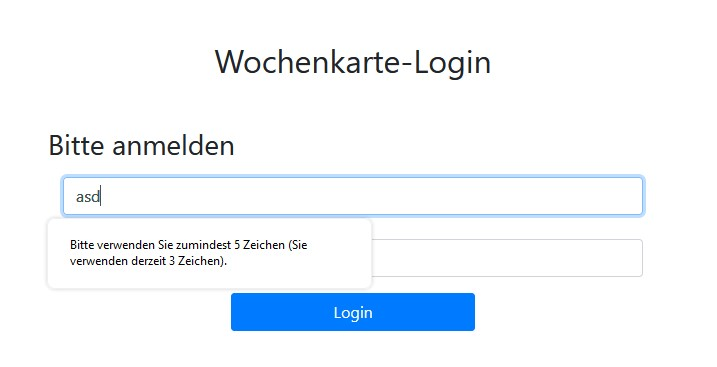

### Passwort

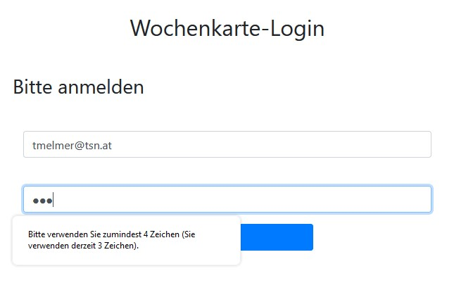

### Beides zu lang

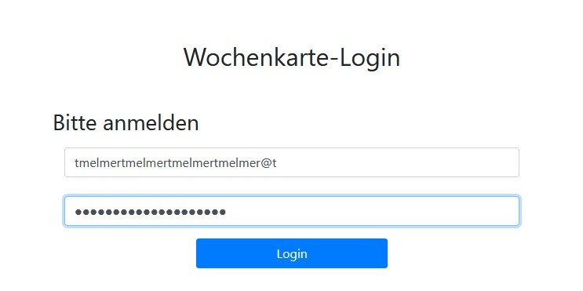
eine längere Eingabe ist nicht möglich...

## Serverseitige Validierung

### Email

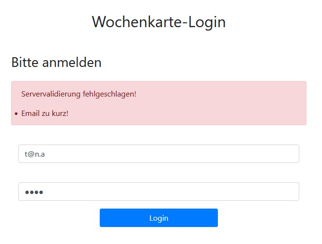

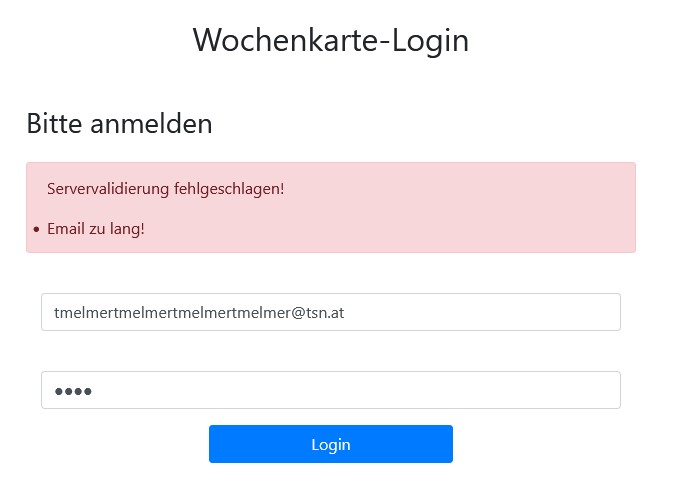

### Passswort

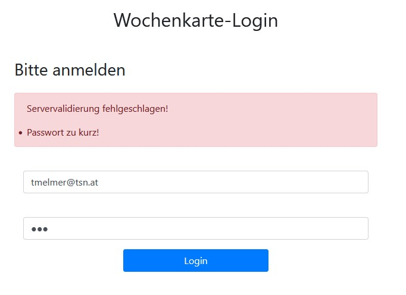

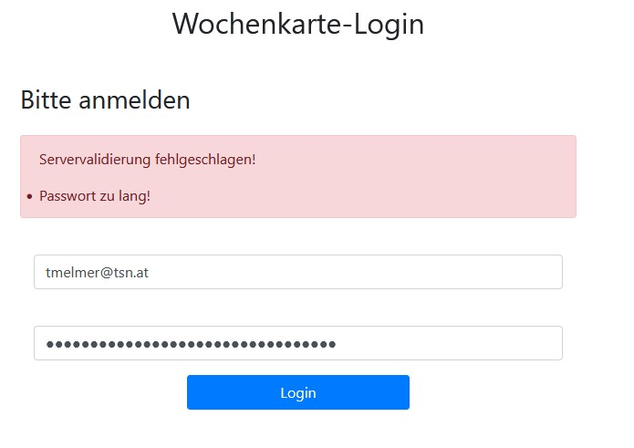

## Responsive Design

### Wochenkarte im breiten Browser
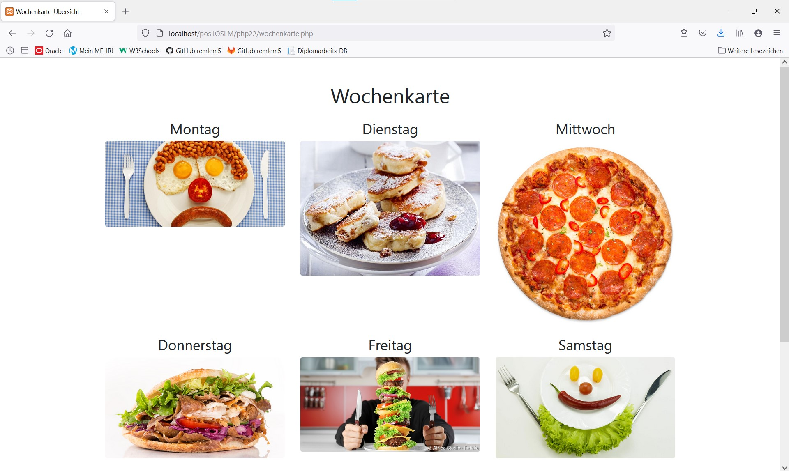

### Wochenkarte im schnalen Browser
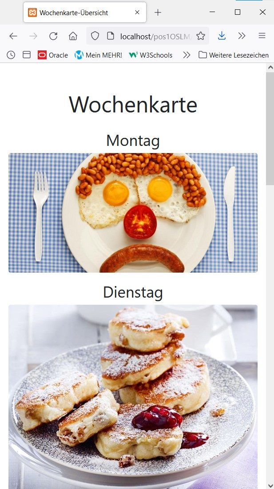

## Funktionstest

wird im Video gezeigt

### User nicht angelegt

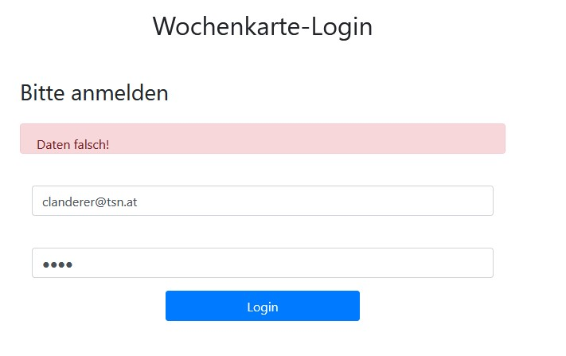

### Passwort falsch

User korrekt aber Passwort falsch!

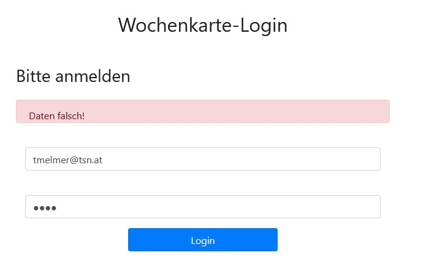

