# Testprotokoll

## index.php

Alle Bücher in Tabelle 
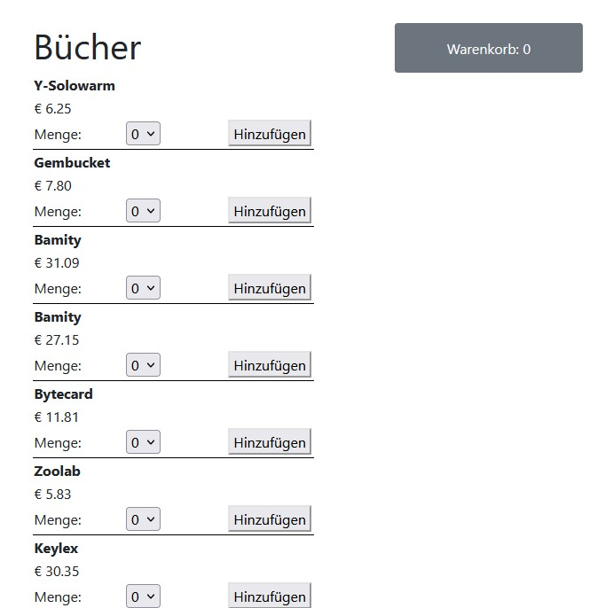

## einkaufswagen.php

leerer Warenkorb 
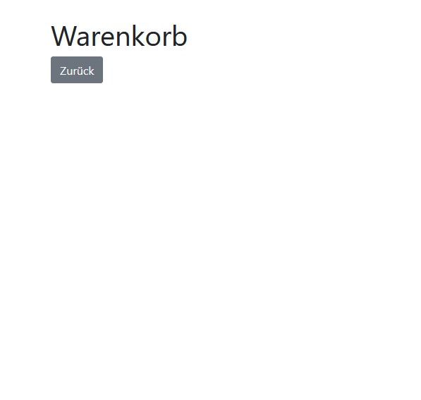

Warenkorb befüllt 
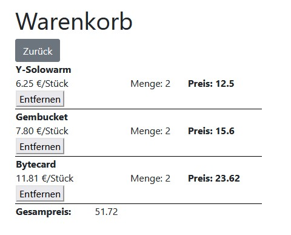

Anzahl der Artikel im Warenkorb wird auf index.php angezeigt 
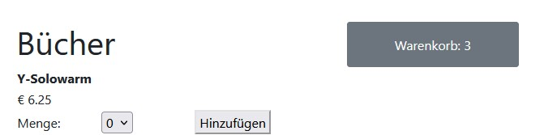

an der Optik könnte man noch was machen, aber die FUnktionalität steht im Vordergrund, denke ich

## Cookie

Cookie im Web-Speicher 
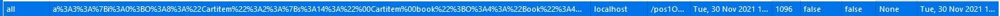

Inhalt des Cookies 
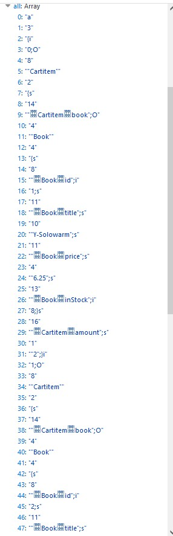

Inhalt des Cookies als var_dump() 
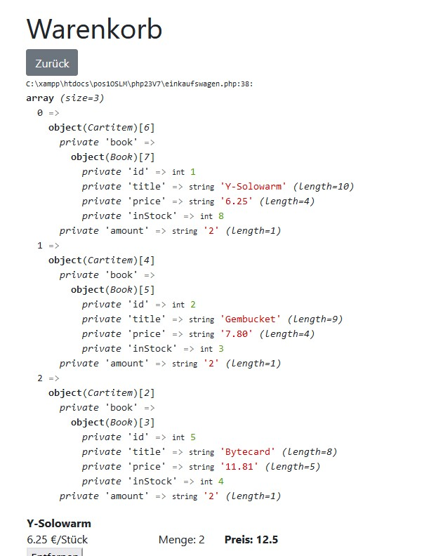

## Stock

für jedes Buch in der Liste ist das DropDown zum Auswählen der Stückzahl an die Menge im Stock gebunden 
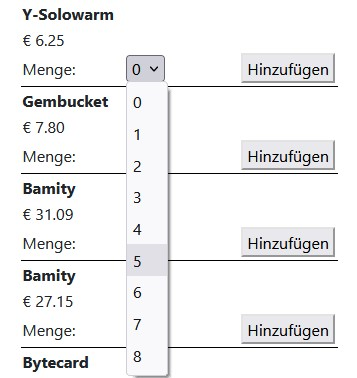

5 Stück des ersten Buches werden in den Warenkorb gelegt 
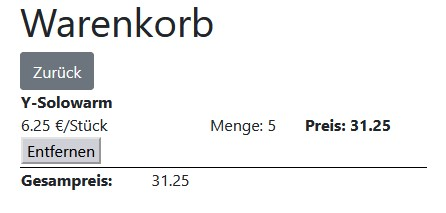

verfügbare Stückzahl im DropDown wird angepasst 
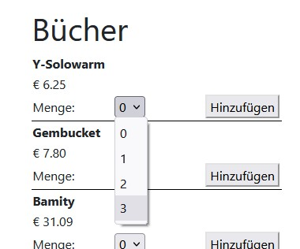

wenn ein Buch schon im Warenkorb liegt, wird die zusätzlich ausgewählte Stückzahl bei dem Buch im Warenkorb dazu gezählt 
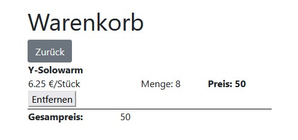

wenn kein Buch mehr verfügbar ist, ändert sich das DropDown zu "Ausverkauft". Die Anzeige hätte man auch anderst lösen können, aber für mich steht wieder die Funktionalität im Vordergrund 
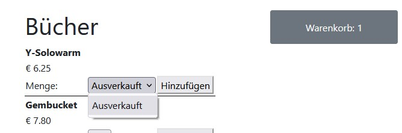

## Preise

### Preis pro Position

für jede Position im Warenkorb wird der Gesamtpreis ausgegeben 
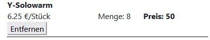

### Gesamtpreis

unter der Tablle mit den einzelnen Positionen wird der Gesamtpreis des Warenkorbs ausgegeben 
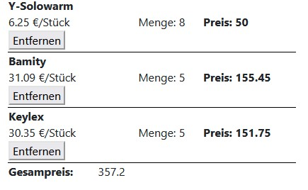

## Entfernen

jede Position im Warenkorb kann wieder entfernt werden 
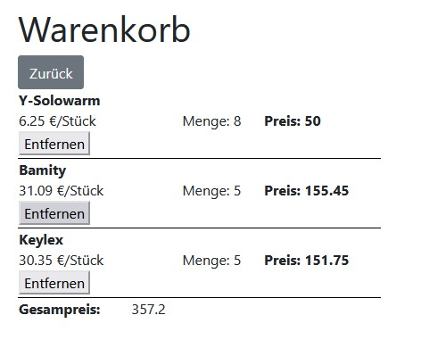
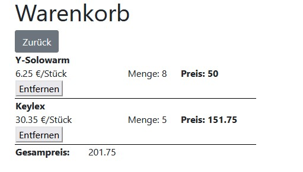
der Gesamtpreis wird sofort neu berechnet 

die Stückzahl im DropDown wird wieder angepasst 
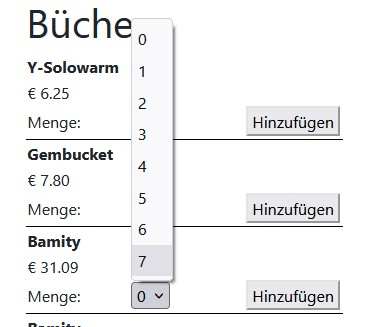
